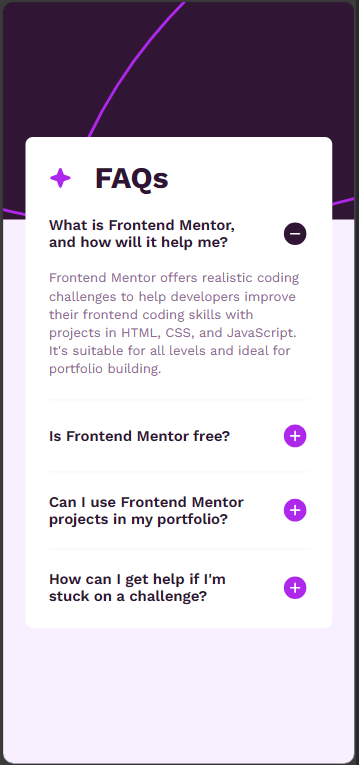
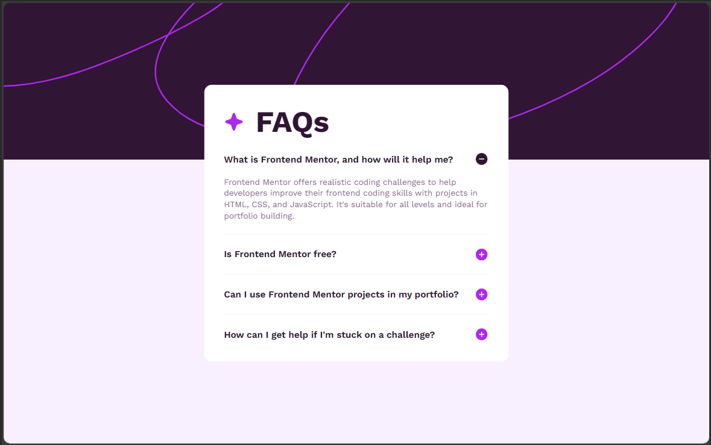
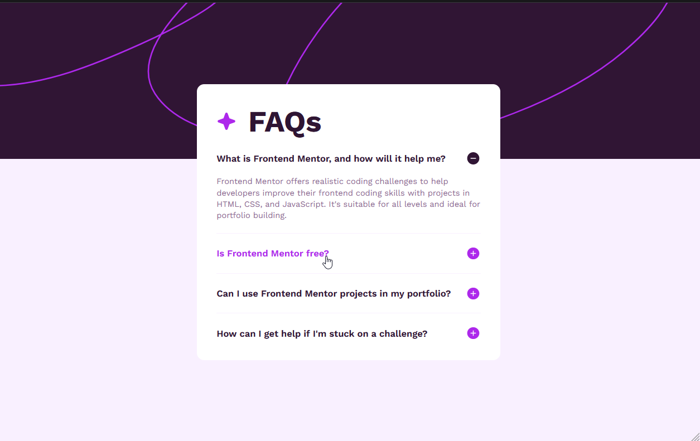
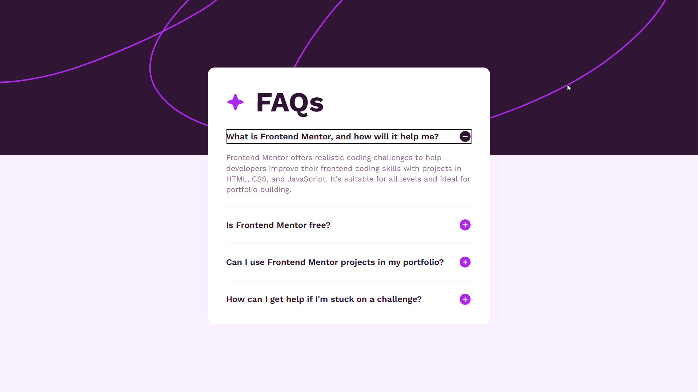

# Frontend Mentor - FAQ accordion solution

This is a solution to the [FAQ accordion challenge on Frontend Mentor](https://www.frontendmentor.io/challenges/faq-accordion-wyfFdeBwBz). Frontend Mentor challenges help you improve your coding skills by building realistic projects. 

## Table of contents

- [Overview](#overview)
  - [The challenge](#the-challenge)
  - [Screenshot](#screenshot)
    - [Mobile Version (375x812)](#mobile-version-(375x812))
    - [Desktop Version (1440x900)](#desktop-version-(1440x900))
    - [Desktop Active States](#desktop-active-states)
    - [Desktop FullScreen Version (1920x1080)](#desktop-fullscreen-version-(1920x1080))
  - [Links](#links)
- [My process](#my-process)
  - [Built with](#built-with)
  - [What I learned](#what-i-learned)
  - [Continued development](#continued-development)
  - [Useful resources](#useful-resources)
- [Author](#author)

## Overview

### The challenge

Users should be able to:

- Hide/Show the answer to a question when the question is clicked
- Navigate the questions and hide/show answers using keyboard navigation alone
- View the optimal layout for the interface depending on their device's screen size
- See hover and focus states for all interactive elements on the page

The challenge doesn't specify wether to hide or not the rest of the answeres when the user shows any of the them, so I took the liberty of implementing that feature. This way, I make sure that the accordion never have an exessive height.

**Observation**

There is a native way for doing this in HTML, however, it is not supported in all browsers. That's why I created a branch called ```general-browser-version``` which has extra JS code that handles that and it should work in most up to date browsers.

The native way should work on Edge and Chrome.

### Screenshot

#### Mobile Version (375x812)



#### Desktop Version (1440x900)



#### Desktop Active States



#### Desktop FullScreen Version (1920x1080)



### Links

- Live Site URL: [Solution GitHub Live Site](https://eduardosaavedraq.github.io/ESQ_faq-accordion-main/)
## My process

### Built with

- Semantic HTML5 markup
- Flexbox
- Mobile-first workflow

### What I learned

This was the third challenge I do and I feel like this time I made a true responsive design. I've tried to use the less media CSS querys as possible and I personally believe that I did a better job than in the previous two challenges. Of course, I always accept feedback from others.

What I think that was really useful is the clamp function. This made so much easier making responsive font sizes.

```css
h1 {
    /*Composition*/
    column-gap: 24px;

    /*Typhography*/
    font-weight: 700;
    font-size: clamp(2rem, 4vw + 1rem, 3.8rem); /*Between 32px and 60.8px (normal)*/
}
```

### Continued development

Until now, I've been using flex box; however I think I need to start using also grid. I believe, it is important to practice responsive web design for both of them.

### Useful resources

- [w3schools HTML tutorial](https://www.w3schools.com/html/default.asp)
- [w3schools CSS tutorial](https://www.w3schools.com/css/default.asp)
- [Clamp CSS function documentation](https://developer.mozilla.org/en-US/docs/Web/CSS/clamp)

## Author

- GitHub - [@EduardoSaavedraQ](https://github.com/EduardoSaavedraQ)
- Frontend Mentor - [@EduardoSaavedraQ](https://www.frontendmentor.io/profile/EduardoSaavedraQ)